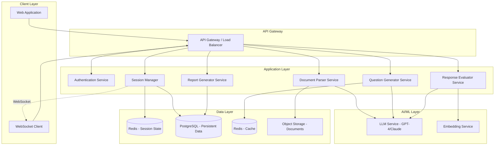

# Design Document: AI-Powered Mock Interview Platform

## Overview

The AI-Powered Mock Interview Platform is a web-based system that simulates realistic technical interview environments using artificial intelligence. The platform provides candidates with adaptive, personalized interview practice by analyzing their resumes and target job descriptions, generating contextually relevant questions, evaluating responses in real-time, and producing comprehensive performance reports.

### Core Capabilities

- **Document Intelligence**: Extracts structured information from resumes and job descriptions in multiple formats (PDF, DOCX, plain text)
- **Adaptive Question Generation**: Uses LLM-powered question generation with dynamic difficulty adjustment based on candidate performance
- **Real-Time Evaluation**: Assesses responses across multiple dimensions (accuracy, clarity, depth, relevance, time efficiency) using semantic similarity and LLM-as-judge approaches
- **Session Management**: Maintains stateful interview sessions with persistence, recovery, and real-time updates
- **Performance Analytics**: Generates detailed readiness reports with skill-area breakdowns, trend analysis, and actionable feedback

### Design Principles

1. **Modularity**: Clear separation between document parsing, question generation, evaluation, and reporting components
2. **Scalability**: Stateless API design with distributed session management to support concurrent users
3. **Resilience**: Session state persistence and recovery mechanisms to handle network interruptions
4. **Performance**: Asynchronous processing with caching strategies to meet strict latency requirements
5. **Extensibility**: Plugin architecture for adding new question types, evaluation metrics, and document formats

## Architecture

### System Architecture

The platform follows a microservices-inspired architecture with clear component boundaries:



### Technology Stack

**Frontend**:
- React/Next.js for UI components
- WebSocket client for real-time updates
- TailwindCSS for styling
- React Query for state management

**Backend**:
- Node.js/Express or Python/FastAPI for API services
- WebSocket server (Socket.io or native WebSocket)
- Bull/BullMQ for job queues

**AI/ML**:
- OpenAI GPT-4 or Anthropic Claude for question generation and evaluation
- Sentence-Transformers or OpenAI embeddings for semantic similarity
- LangChain for LLM orchestration

**Data Storage**:
- PostgreSQL for persistent data (user profiles, session history, analytics)
- Redis for session state, caching, and pub/sub
- S3/MinIO for document storage

**Infrastructure**:
- Docker containers for service deployment
- Kubernetes or Docker Compose for orchestration
- Nginx for reverse proxy and load balancing

## Components and Interfaces

### 1. Document Parser Service

**Responsibility**: Extract structured information from resumes and job descriptions.

**Key Components**:

- **File Handler**: Validates file format, size, and handles upload
- **PDF Parser**: Extracts text from PDF files using libraries like `pdf-parse` or `PyPDF2`
- **DOCX Parser**: Extracts text from Word documents using `mammoth` or `python-docx`
- **Text Extractor**: Normalizes extracted text (removes formatting, handles encoding)
- **Information Extractor**: Uses LLM with structured prompts to extract:
  - Skills (categorized by domain)
  - Work experience (titles, companies, durations, responsibilities)
  - Projects (descriptions, technologies)
  - Education
  - Certifications

**Interface**:

```typescript
interface DocumentParserService {
  parseResume(file: File): Promise<ParsedResume>
  parseJobDescription(file: File | string): Promise<ParsedJobDescription>
}

interface ParsedResume {
  skills: SkillCategory[]
  experience: WorkExperience[]
  projects: Project[]
  education: Education[]
  certifications: string[]
  rawText: string
}

interface ParsedJobDescription {
  requiredSkills: SkillCategory[]
  preferredSkills: SkillCategory[]
  responsibilities: string[]
  experienceLevel: 'Entry' | 'Mid' | 'Senior' | 'Lead'
  minimumYears: number
  rawText: string
}

interface SkillCategory {
  category: string  // e.g., "Programming Languages", "Frameworks", "Databases"
  skills: string[]
}
```

**Implementation Notes**:
- Use LLM with few-shot prompting for structured extraction
- Implement retry logic for parsing failures
- Cache parsed results with document hash as key
- Target: <3 seconds parsing time

### 2. Question Generator Service

**Responsibility**: Generate contextually relevant interview questions with appropriate difficulty levels.

**Key Components**:

- **Context Analyzer**: Analyzes resume and JD to identify skill gaps and focus areas
- **Question Template Manager**: Maintains templates for different question types
- **LLM Question Generator**: Uses LLM to generate questions based on context and templates
- **Difficulty Controller**: Assigns and adjusts difficulty levels
- **Question Validator**: Ensures questions are clear, grammatically correct, and appropriate
- **Diversity Manager**: Prevents question repetition and ensures variety

**Interface**:

```typescript
interface QuestionGeneratorService {
  generateInitialQuestions(
    resume: ParsedResume,
    jobDescription: ParsedJobDescription,
    config: InterviewConfig
  ): Promise<Question[]>
  
  generateNextQuestion(
    sessionContext: SessionContext,
    previousResponses: ResponseHistory[]
  ): Promise<Question>
}

interface Question {
  id: string
  type: 'technical' | 'conceptual' | 'behavioral' | 'scenario'
  difficulty: 'Easy' | 'Medium' | 'Hard'
  skillArea: string
  text: string
  expectedResponseFormat: 'text' | 'code' | 'diagram'
  timeLimit: number  // seconds
  evaluationCriteria: EvaluationCriteria
  metadata: {
    relatedSkills: string[]
    projectReference?: string
  }
}

interface InterviewConfig {
  duration: 30 | 45 | 60  // minutes
  focusAreas?: string[]
  initialDifficulty: 'Easy' | 'Medium' | 'Hard'
}
```

**Implementation Notes**:
- Pre-generate 3-5 questions at session start to reduce latency
- Use LLM with system prompts that include resume/JD context
- Implement question caching by skill area and difficulty
- Track used questions per candidate to avoid repetition
- Target: <5 seconds generation time

### 3. Response Evaluator Service

**Responsibility**: Evaluate candidate responses across multiple dimensions and assign scores.

**Key Components**:

- **Response Preprocessor**: Normalizes response text, extracts code blocks
- **Semantic Evaluator**: Uses embeddings and cosine similarity for semantic matching
- **LLM Judge**: Uses LLM to evaluate response quality with structured rubrics
- **Code Evaluator**: Validates code syntax and logic (for technical questions)
- **Time Analyzer**: Calculates time efficiency and applies penalties
- **Score Aggregator**: Combines multiple evaluation dimensions into final score

**Interface**:

```typescript
interface ResponseEvaluatorService {
  evaluateResponse(
    question: Question,
    response: CandidateResponse,
    context: SessionContext
  ): Promise<EvaluationResult>
}

interface CandidateResponse {
  questionId: string
  content: string
  format: 'text' | 'code' | 'diagram'
  timeSpent: number  // seconds
  submittedAt: Date
}

interface EvaluationResult {
  score: number  // 0-100
  dimensions: {
    accuracy: number
    clarity: number
    depth: number
    relevance: number
    timeEfficiency: number
  }
  feedback: string
  strengths: string[]
  improvements: string[]
  exampleBetterResponse?: string
}
```

**Implementation Notes**:
- Use multi-stage evaluation: quick semantic check → detailed LLM evaluation
- Implement evaluation rubrics as structured prompts
- Cache evaluation results for identical responses
- Apply time penalties: 10% reduction for 10-20% overtime, 25% for >20% overtime
- Target: <5 seconds evaluation time

### 4. Session Manager Service

**Responsibility**: Manage interview session lifecycle, state, and real-time updates.

**Key Components**:

- **Session Controller**: Creates, updates, and terminates sessions
- **State Manager**: Persists and retrieves session state from Redis
- **WebSocket Manager**: Handles real-time communication with clients
- **Performance Tracker**: Calculates running performance scores
- **Termination Controller**: Implements early termination logic
- **Recovery Manager**: Handles session recovery after interruptions

**Interface**:

```typescript
interface SessionManagerService {
  createSession(
    candidateId: string,
    resume: ParsedResume,
    jobDescription: ParsedJobDescription,
    config: InterviewConfig
  ): Promise<Session>
  
  updateSession(sessionId: string, update: SessionUpdate): Promise<void>
  
  getSession(sessionId: string): Promise<Session>
  
  terminateSession(sessionId: string, reason: string): Promise<void>
  
  recoverSession(sessionId: string): Promise<Session>
}

interface Session {
  id: string
  candidateId: string
  status: 'active' | 'paused' | 'completed' | 'terminated'
  startedAt: Date
  config: InterviewConfig
  context: {
    resume: ParsedResume
    jobDescription: ParsedJobDescription
  }
  state: SessionState
}

interface SessionState {
  currentQuestionIndex: number
  questions: Question[]
  responses: ResponseHistory[]
  performanceScore: number
  skillAreaScores: Record<string, number>
  elapsedTime: number
  lastActivity: Date
}

interface ResponseHistory {
  question: Question
  response: CandidateResponse
  evaluation: EvaluationResult
  timestamp: Date
}
```

**Implementation Notes**:
- Store session state in Redis with TTL (24 hours)
- Persist completed sessions to PostgreSQL
- Use Redis pub/sub for WebSocket message distribution
- Implement heartbeat mechanism for connection monitoring
- Check for early termination after every 3 questions (after minimum 5 questions)
- Performance threshold: 40/100

### 5. Report Generator Service

**Responsibility**: Generate comprehensive readiness reports with analytics and recommendations.

**Key Components**:

- **Performance Analyzer**: Calculates overall and skill-area scores
- **Trend Analyzer**: Identifies performance trends across sessions
- **Strength/Weakness Identifier**: Extracts top strengths and weaknesses
- **Recommendation Engine**: Generates actionable improvement suggestions
- **Report Formatter**: Formats report in multiple output formats (JSON, PDF, HTML)

**Interface**:

```typescript
interface ReportGeneratorService {
  generateReport(sessionId: string): Promise<ReadinessReport>
  
  generateTrendReport(candidateId: string): Promise<TrendReport>
}

interface ReadinessReport {
  sessionId: string
  candidateId: string
  generatedAt: Date
  overallScore: number
  readinessLevel: 'Ready' | 'Needs Improvement' | 'Not Ready'
  skillAreaBreakdown: SkillAreaScore[]
  strengths: Strength[]
  weaknesses: Weakness[]
  questionFeedback: QuestionFeedback[]
  timeManagement: TimeAnalysis
  recommendations: Recommendation[]
}

interface SkillAreaScore {
  skillArea: string
  score: number
  questionsAsked: number
  averageTimeSpent: number
}

interface Strength {
  area: string
  description: string
  evidence: string[]
}

interface Weakness {
  area: string
  description: string
  impact: 'High' | 'Medium' | 'Low'
  recommendations: string[]
}

interface QuestionFeedback {
  question: string
  yourResponse: string
  score: number
  feedback: string
  betterApproach?: string
}

interface TimeAnalysis {
  totalTime: number
  averageTimePerQuestion: number
  questionsOverTime: number
  timeEfficiencyScore: number
}

interface TrendReport {
  candidateId: string
  sessionsAnalyzed: number
  overallTrend: 'Improving' | 'Stable' | 'Declining'
  skillAreaTrends: SkillAreaTrend[]
  recommendations: string[]
}

interface SkillAreaTrend {
  skillArea: string
  trend: 'Improving' | 'Stable' | 'Declining'
  scoreHistory: { date: Date; score: number }[]
}
```

**Implementation Notes**:
- Use LLM to generate natural language feedback and recommendations
- Calculate readiness level: ≥75 = Ready, 50-74 = Needs Improvement, <50 = Not Ready
- Identify top 3 strengths and weaknesses based on skill area scores
- Target: <10 seconds report generation time

## Data Models

### Database Schema (PostgreSQL)

```sql
-- Users/Candidates
CREATE TABLE candidates (
  id UUID PRIMARY KEY DEFAULT gen_random_uuid(),
  email VARCHAR(255) UNIQUE NOT NULL,
  name VARCHAR(255) NOT NULL,
  created_at TIMESTAMP DEFAULT NOW(),
  updated_at TIMESTAMP DEFAULT NOW()
);

-- Interview Sessions
CREATE TABLE interview_sessions (
  id UUID PRIMARY KEY DEFAULT gen_random_uuid(),
  candidate_id UUID REFERENCES candidates(id),
  status VARCHAR(50) NOT NULL,
  config JSONB NOT NULL,
  resume_data JSONB NOT NULL,
  job_description_data JSONB NOT NULL,
  started_at TIMESTAMP NOT NULL,
  completed_at TIMESTAMP,
  terminated_at TIMESTAMP,
  termination_reason TEXT,
  overall_score DECIMAL(5,2),
  created_at TIMESTAMP DEFAULT NOW()
);

-- Questions Asked
CREATE TABLE session_questions (
  id UUID PRIMARY KEY DEFAULT gen_random_uuid(),
  session_id UUID REFERENCES interview_sessions(id),
  question_index INTEGER NOT NULL,
  question_data JSONB NOT NULL,
  response_data JSONB,
  evaluation_data JSONB,
  time_spent INTEGER,
  created_at TIMESTAMP DEFAULT NOW()
);

-- Performance Analytics
CREATE TABLE performance_metrics (
  id UUID PRIMARY KEY DEFAULT gen_random_uuid(),
  session_id UUID REFERENCES interview_sessions(id),
  skill_area VARCHAR(255) NOT NULL,
  score DECIMAL(5,2) NOT NULL,
  questions_count INTEGER NOT NULL,
  average_time INTEGER NOT NULL,
  created_at TIMESTAMP DEFAULT NOW()
);

-- Readiness Reports
CREATE TABLE readiness_reports (
  id UUID PRIMARY KEY DEFAULT gen_random_uuid(),
  session_id UUID REFERENCES interview_sessions(id),
  report_data JSONB NOT NULL,
  generated_at TIMESTAMP DEFAULT NOW()
);

-- Indexes
CREATE INDEX idx_sessions_candidate ON interview_sessions(candidate_id);
CREATE INDEX idx_sessions_status ON interview_sessions(status);
CREATE INDEX idx_questions_session ON session_questions(session_id);
CREATE INDEX idx_metrics_session ON performance_metrics(session_id);
CREATE INDEX idx_metrics_skill ON performance_metrics(skill_area);
```

### Redis Data Structures

```typescript
// Session State (Hash)
// Key: session:{sessionId}
// TTL: 24 hours
{
  id: string
  candidateId: string
  status: string
  currentQuestionIndex: number
  questions: string  // JSON array
  responses: string  // JSON array
  performanceScore: number
  skillAreaScores: string  // JSON object
  elapsedTime: number
  lastActivity: string  // ISO timestamp
}

// Active Sessions Set
// Key: active_sessions:{candidateId}
// Members: sessionId[]

// Question Cache (Hash)
// Key: question_cache:{skillArea}:{difficulty}
// TTL: 7 days
{
  questions: string  // JSON array of pre-generated questions
}

// Parsed Document Cache (String)
// Key: document:{hash}
// TTL: 30 days
// Value: JSON string of parsed document

// WebSocket Connections (Hash)
// Key: ws_connections:{sessionId}
// Fields: connectionId -> candidateId
```

## API Specifications

### REST API Endpoints

```typescript
// Authentication
POST /api/auth/register
POST /api/auth/login
POST /api/auth/logout

// Document Upload & Parsing
POST /api/documents/parse-resume
  Body: { file: File }
  Response: { resumeId: string, parsed: ParsedResume }

POST /api/documents/parse-job-description
  Body: { file?: File, text?: string }
  Response: { jdId: string, parsed: ParsedJobDescription }

// Session Management
POST /api/sessions/create
  Body: {
    resumeId: string,
    jdId: string,
    config: InterviewConfig
  }
  Response: { sessionId: string, session: Session }

GET /api/sessions/:sessionId
  Response: { session: Session }

POST /api/sessions/:sessionId/terminate
  Body: { reason: string }
  Response: { success: boolean }

// Questions & Responses
GET /api/sessions/:sessionId/current-question
  Response: { question: Question }

POST /api/sessions/:sessionId/submit-response
  Body: { response: CandidateResponse }
  Response: {
    evaluation: EvaluationResult,
    nextQuestion?: Question,
    sessionComplete?: boolean
  }

// Reports
GET /api/sessions/:sessionId/report
  Response: { report: ReadinessReport }

GET /api/candidates/:candidateId/trend-report
  Response: { report: TrendReport }

// Analytics
GET /api/candidates/:candidateId/sessions
  Response: { sessions: Session[] }

GET /api/candidates/:candidateId/performance-history
  Response: { history: PerformanceHistory }
```

### WebSocket Events

```typescript
// Client → Server
{
  type: 'session.join',
  payload: { sessionId: string, token: string }
}

{
  type: 'response.submit',
  payload: { response: CandidateResponse }
}

{
  type: 'heartbeat',
  payload: { timestamp: number }
}

// Server → Client
{
  type: 'session.connected',
  payload: { sessionId: string, currentState: SessionState }
}

{
  type: 'question.new',
  payload: { question: Question }
}

{
  type: 'evaluation.complete',
  payload: { evaluation: EvaluationResult }
}

{
  type: 'session.terminated',
  payload: { reason: string, partialReport: ReadinessReport }
}

{
  type: 'timer.update',
  payload: { remainingTime: number }
}

{
  type: 'error',
  payload: { message: string, code: string }
}
```

## Error Handling

### Error Categories

1. **Validation Errors** (400)
   - Invalid file format
   - Missing required fields
   - Invalid configuration parameters

2. **Authentication Errors** (401, 403)
   - Invalid credentials
   - Expired session token
   - Insufficient permissions

3. **Resource Errors** (404)
   - Session not found
   - Document not found
   - Candidate not found

4. **Processing Errors** (500)
   - Document parsing failure
   - LLM API failure
   - Database connection error

5. **Rate Limiting Errors** (429)
   - Too many requests
   - LLM quota exceeded

### Error Response Format

```typescript
interface ErrorResponse {
  error: {
    code: string
    message: string
    details?: any
    timestamp: string
  }
}
```

### Error Handling Strategies

- **Retry Logic**: Implement exponential backoff for LLM API calls (max 3 retries)
- **Fallback Mechanisms**: Use cached questions if generation fails
- **Graceful Degradation**: Continue session with reduced features if non-critical services fail
- **Circuit Breaker**: Temporarily disable failing services to prevent cascade failures
- **Error Logging**: Log all errors with context for debugging and monitoring

## Testing Strategy

### Unit Testing

- **Document Parser**: Test extraction accuracy with sample resumes/JDs in various formats
- **Question Generator**: Verify question quality, diversity, and difficulty assignment
- **Response Evaluator**: Test scoring accuracy with known good/bad responses
- **Session Manager**: Test state transitions and persistence
- **Report Generator**: Verify calculation accuracy and report completeness

### Integration Testing

- **End-to-End Flows**: Test complete interview session from upload to report
- **API Endpoints**: Test all REST endpoints with various inputs
- **WebSocket Communication**: Test real-time updates and reconnection
- **Database Operations**: Test CRUD operations and data integrity
- **External Services**: Test LLM API integration with mocked responses

### Performance Testing

- **Load Testing**: Simulate 100+ concurrent interview sessions
- **Latency Testing**: Verify response times meet requirements:
  - Document parsing: <3 seconds
  - Question generation: <5 seconds
  - Response evaluation: <5 seconds
  - Report generation: <10 seconds
- **Stress Testing**: Test system behavior under extreme load
- **Endurance Testing**: Run extended sessions to detect memory leaks

### Property-Based Testing

Property-based testing is **NOT applicable** for this feature because:

1. **Infrastructure and External Services**: The system heavily relies on external LLM APIs (OpenAI, Anthropic), document parsing libraries, and database operations. These are external service behaviors that should be tested with integration tests, not property-based tests.

2. **Non-Deterministic AI Behavior**: LLM-generated questions and evaluations are inherently non-deterministic. Running the same input 100 times will produce different outputs, making universal properties difficult to define.

3. **Stateful Session Management**: Interview sessions are complex stateful workflows with side effects (database writes, WebSocket messages, file storage). Property-based testing works best for pure functions.

4. **UI and User Experience**: Many requirements involve UI rendering, time management displays, and user interactions that are better tested with example-based tests and end-to-end tests.

**Alternative Testing Approaches**:
- **Snapshot Testing**: For LLM prompt templates and report formats
- **Mock-Based Unit Tests**: For testing service logic with mocked LLM responses
- **Integration Tests**: For end-to-end workflows with real or mocked external services
- **Contract Testing**: For API endpoint validation
- **Chaos Engineering**: For resilience testing (network failures, service outages)

### Security Testing

- **Input Validation**: Test for injection attacks (SQL, XSS, command injection)
- **Authentication**: Test token validation and session management
- **Authorization**: Verify access control for resources
- **File Upload**: Test for malicious file uploads
- **Rate Limiting**: Verify rate limiting effectiveness

## Implementation Considerations

### Performance Optimization

1. **Caching Strategy**:
   - Cache parsed documents (30-day TTL)
   - Cache generated questions by skill area (7-day TTL)
   - Cache LLM responses for identical prompts (24-hour TTL)

2. **Asynchronous Processing**:
   - Use job queues for report generation
   - Pre-generate questions in background
   - Async document parsing with progress updates

3. **Database Optimization**:
   - Index frequently queried fields
   - Use connection pooling
   - Implement read replicas for analytics queries

4. **LLM Optimization**:
   - Batch similar requests
   - Use streaming for long responses
   - Implement prompt caching
   - Use cheaper models for simple tasks (e.g., GPT-3.5 for validation)

### Scalability Considerations

1. **Horizontal Scaling**:
   - Stateless API services (scale with load balancer)
   - Redis cluster for distributed session state
   - Database read replicas for analytics

2. **Resource Management**:
   - Rate limiting per user (10 sessions/day)
   - LLM request throttling
   - Connection pooling for databases

3. **Monitoring & Observability**:
   - Application metrics (request rate, latency, error rate)
   - Business metrics (sessions created, completion rate, average scores)
   - LLM usage metrics (tokens consumed, cost tracking)
   - Infrastructure metrics (CPU, memory, disk, network)

### Security Considerations

1. **Data Protection**:
   - Encrypt sensitive data at rest (resumes, personal info)
   - Use HTTPS for all communications
   - Implement secure file upload validation
   - Sanitize user inputs

2. **Authentication & Authorization**:
   - JWT-based authentication
   - Role-based access control (candidate, admin)
   - Session token expiration (24 hours)

3. **Privacy**:
   - GDPR compliance (data deletion, export)
   - Anonymize data for analytics
   - Clear data retention policies

### Deployment Strategy

1. **Containerization**:
   - Docker containers for each service
   - Docker Compose for local development
   - Kubernetes for production deployment

2. **CI/CD Pipeline**:
   - Automated testing on commit
   - Staging environment for pre-production testing
   - Blue-green deployment for zero-downtime updates

3. **Infrastructure**:
   - Cloud provider (AWS, GCP, or Azure)
   - Managed services (RDS for PostgreSQL, ElastiCache for Redis)
   - CDN for static assets
   - Object storage for documents (S3/GCS)

### Monitoring & Logging

1. **Application Logging**:
   - Structured logging (JSON format)
   - Log levels (DEBUG, INFO, WARN, ERROR)
   - Correlation IDs for request tracing

2. **Monitoring Tools**:
   - Prometheus for metrics collection
   - Grafana for visualization
   - Sentry for error tracking
   - ELK stack for log aggregation

3. **Alerts**:
   - High error rate (>5%)
   - Slow response times (>10s)
   - LLM API failures
   - Database connection issues

### Cost Optimization

1. **LLM Usage**:
   - Use GPT-3.5-turbo for simple tasks
   - Use GPT-4 only for complex evaluation
   - Implement aggressive caching
   - Set token limits per request

2. **Infrastructure**:
   - Auto-scaling based on load
   - Spot instances for non-critical workloads
   - Reserved instances for baseline capacity

3. **Storage**:
   - Lifecycle policies for old documents
   - Compress stored data
   - Archive completed sessions after 90 days

## Future Enhancements

1. **Multi-Modal Support**:
   - Voice-based interviews
   - Video recording and analysis
   - Whiteboard/diagram drawing

2. **Advanced Analytics**:
   - Predictive success modeling
   - Peer comparison benchmarks
   - Industry-specific scoring

3. **Collaborative Features**:
   - Mock interviews with human interviewers
   - Peer review of responses
   - Study groups and practice sessions

4. **Personalization**:
   - Learning path recommendations
   - Adaptive curriculum based on weaknesses
   - Custom question banks

5. **Integration**:
   - LinkedIn profile import
   - GitHub repository analysis
   - LeetCode/HackerRank integration
   - ATS (Applicant Tracking System) integration
